# Lab 01 - Friday January 29th, 2021 (in class lab)

## Github, Linux Command Line Instructions, Regular Expressions and Visual Programming

Maintain a repository on github for all your lab work. Inside, you should create a markdown page (`lab01.md`) for this lab's work. You will be graded by the beginning of the next lab. To submit this assignment, create a text file with 2 lines. The first line should be a link to your github repository and the second link should be the link to your Lab 1 entry. Submit this as the only file to [Submitty](https://submitty.cs.rpi.edu/courses/s21/csci4470).

> Markdown syntax is [here](https://help.github.com/articles/basic-writing-and-formatting-syntax/) and [here](https://guides.github.com/features/mastering-markdown/)

## 0. Join the Discord if you haven't already

1. Join here: [https://discord.gg/R9qyC7aY](https://discord.gg/R9qyC7aY)
2. Post a message into the "#general" channel
   - https://discord.com/channels/799881445455822908/799881445891375124/804775660928106538
3. Take a screenshot the post and paste it into your Lab 1 notebook.
   - 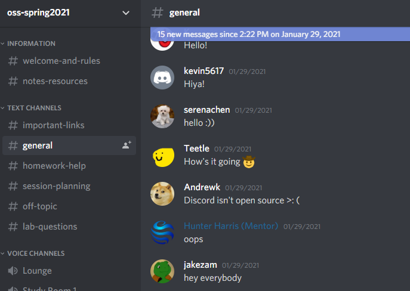

## 1. Create and setup a Github account

1. Go through this tutorial to get familiar with [Git and GitHub](http://readwrite.com/2013/09/30/understanding-github-a-journey-for-beginners-part-1) and to set up a GitHub account.
   - https://github.com/jakezam
2. Fork the [template repository](https://github.com/rcos/oss-repo-template).
   - https://github.com/jakezam/oss-repo-template
3. Fill out the information in the document.
   - Name: Jacob Zamani
   - email: zamanj@rpi.edu
   - github account: jakezam
   - discord: jakezam#7845
   - Photo of me 

## 2. Reading assignments - make sure to reflect on these in `lab1.md` in your repository

1. Please read the 10 criteria of [Open Source Definition](http://opensource.org/osd) and understand why they are important.
2. Please read Eric Raymond's article [Smart Questions - How to ask the question The Smart Way](http://www.catb.org/esr/faqs/smart-questions.html).
3. Do you have more suggestions for `How To Answer Questions in a Helpful Way` (from your past experience)?
   - List at least two.
     - Ask if the person asking the question has referenced Google, Stackoverflow, or Lecture material/Textbooks for the answer to their question
     - If they have searched or it is not an answer they can refernce these sources to achieve then have them quickly explain their solution or what they are trying to do before asking their specific question to get some background
4. Please read chapter 3 of [Free Culture](https://github.com/rcos/CSCI-4470-OpenSource/blob/master/Resources/freeculture.pdf)
   - Write a short paragraph (8 to 10 sentences) of what you got out of reading that chapter.
   - When Jesse Jordan first got to RPI, he began tinkering with the idea of a search engine across the current RPI network. This is different than say Google that searches across the entire internet for results, this would only exist on the RPI network. A search engine for a network within a particular institution was no uncommon across universities and businesses and was referred to as "intranet" search engines. Microsoft had developed a search engine that would access all public information on a specific network, which is the engine Jesse based and referenced for his RPI search engine. However by using the Microsoft engine, and other similar engines, to build his engine, he ended up in a lawsuit for piracy with the RIAA, after finding tons of pirated music on the network. What happened to Jesse was completely unfair and ridiculous, how his fun and helpful project caused him a lawsuit that ended with him losing all of his savings because his users were abusing the system. The importance of protection laws nowadays when working with open-source software is so critical to make sure that any educational or just enjoyable project is protected from what some of its users with use it for.
5. Read the first chapter in [Beautiful Code](https://docs.google.com/viewer?a=v&pid=sites&srcid=ZGVmYXVsdGRvbWFpbnxpb3ZhbmFsZXh8Z3g6MjVjYWFmNjAwYTA0MmMxZA) about the development and implementation (in C) of a very simple `grep`
   - You don't need to record anything here on the reading, but it will help you with the exercises on `grep`, `egrep`, and `regex`.

## 3. Linux

1. Boot linux (Ubuntu) through a USB, dual boot, or WSL (version 2 strongly recommended)
   - Get familiar with the directory structure.
   - Practice with `ls`, `cd`, `mkdir`, `chmod` commands - when in doubt search the web to find the answer.
2. Practice with `grep`, `egrep` commands
   - Look at the manual (`man grep`) to see how to use these commands.
3. Install tree and get the directory structure.
   - On linux: `sudo apt-get install tree`, or use the Ubuntu software install
   - For Ubuntu versions 18.04 and greater:
     - `sudo snap install tree`
     - `tree --help`
   - On OSX: `brew install tree`
   - On WSL, it looks like it is already available [https://docs.microsoft.com/en-us/windows-server/administration/windows-commands/tree](https://docs.microsoft.com/en-us/windows-server/administration/windows-commands/tree)
   - Run `man tree`
   - Take a screenshot and add to `lab01.md`
     - 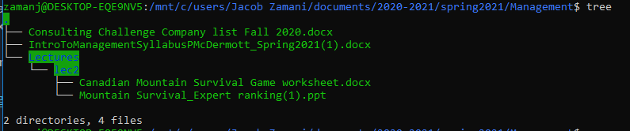

## 4. Regex

1. In your Foundations of Computer Science class you learned about Regular expressions. (If you have not taken Foundations of Computer Science class, please talk to the instructor for an explanation). Please do the practice problems given [here](https://regexone.com/problem/matching_decimal_numbers).
   - To get full credit, do at least 7 problems.
   - Take a screenshot and add to `lab01.md`
   - 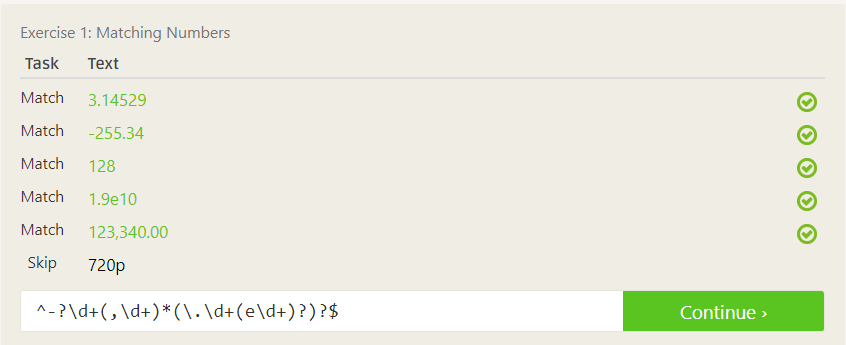
   - 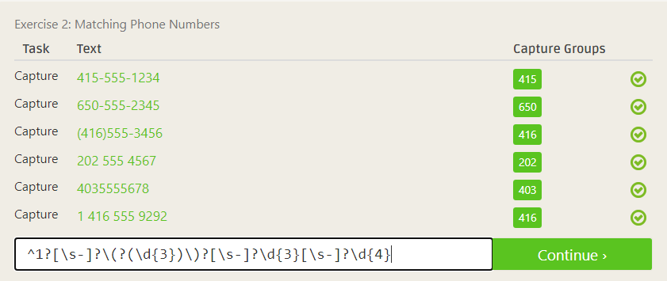
   - 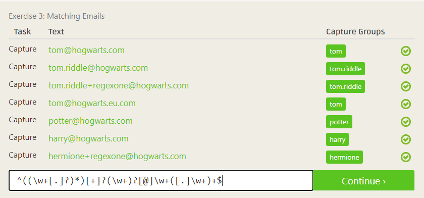
   - 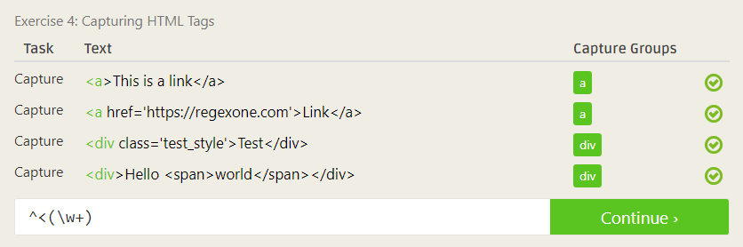
   - 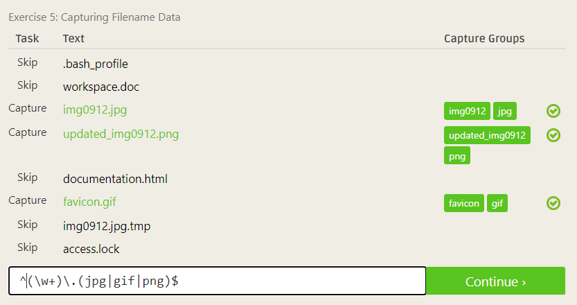
   - 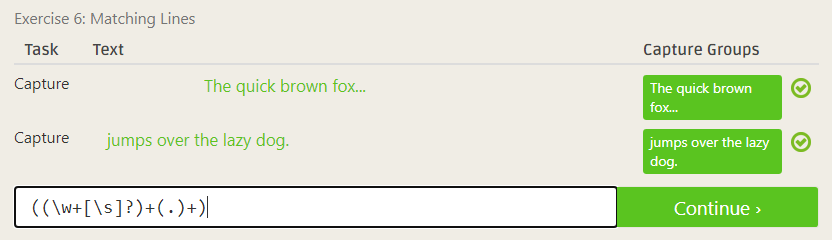
   - 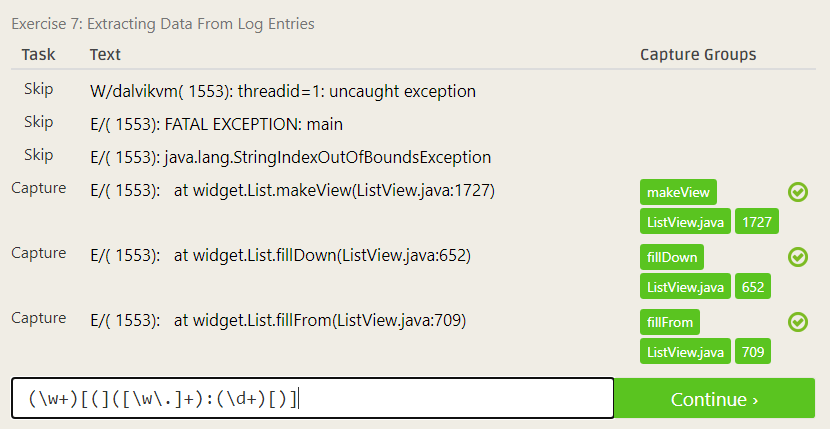
2. Go through the tutorials [here](https://regexcrossword.com/challenges/tutorial/puzzles/1) to practice regex crosswords, then try a few problems.
   - Do at least four problems on beginner level [here](https://regexcrossword.com/challenges/beginner/puzzles/1).
   - Take a screenshot and add to `lab01.md`
   - 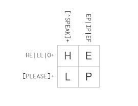
   - 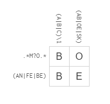
   - 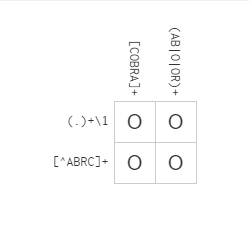
   - 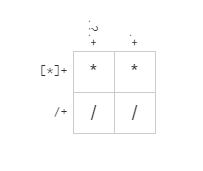
3. (Optional But Recommended) Do problem 11 in [adventofcode 2015](http://adventofcode.com/2015/day/11) (You may use regular expression)

## 5. Play with [Snap](http://snap.berkeley.edu/) or [Blockly](https://blockly-games.appspot.com/)

1. Create something using Snap or solve [this](https://blockly-games.appspot.com/maze?lang=en&level=10&skin=0) using blockly
2. Add documentation (screenshots) of your accomplishments to `lab1.md`
   - 

## 6. Reflection

1. Pick an Open Source Project that might be interesting to evaluate
2. Start thinking/finding a problem/project that interests you
3. Add a paragraph on how you are doing this activity to `lab01.md`
4. Check out [http://aosabook.org/en/index.html](http://aosabook.org/en/index.html) for a list of a number of open source projects and for a discussion of the architectures they use.

<!--#### Revisit e. Replace with TOS activity on evaluating open source ...
[foss2serve](http://foss2serve.org/index.php/Intro_to_FOSS_Project_Anatomy_(Activity)), [Evaluation](http://users.dickinson.edu/~braught/courses/cs491f17/projexpl.html)
[projects](http://foss2serve.org/index.php/HFOSS_Projects), [RCOS](https://rcos.io/projects), others.
-->
