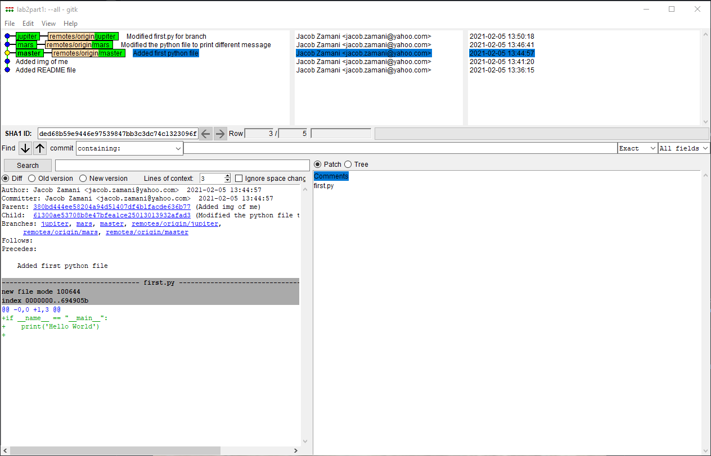
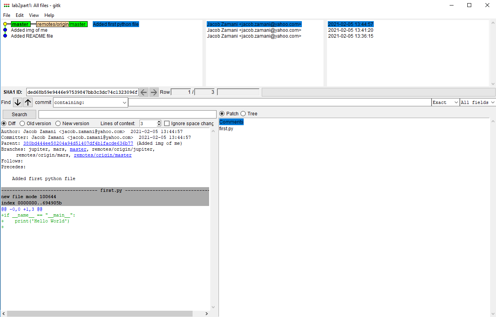

## This lab (Lab #2 on 2/5/2021) is about Git (local repository), Github and a few of the commands you need to know to effectively manage an open source project.

### Since we are already practicing git in class as part of our git lecture, you should not need the whole period. Accordingly, we will take the first 40 minutes or so to finish our discussion of git first.

## Your Lab report will be Lab2.md

Commands used will include `git add`, `git commit`, `git pull`, `git checkout`, `git branch`, `git push`, `git log`, `git status`, `git diff` , `git tag`, `git rebase` and `git merge`

- Use the command line (or git shell) for this lab

> The command line is preferred - your ubuntu installation or `gitbash` will help if you decide to experiment with the command line

Useful pages:

- A cheat sheet for [git commands](cheat_sheet_git_final.pdf)
- A very nice [book about git](https://git-scm.com/book/en/v2)
- A cheat sheet for [Markdown](https://github.com/adam-p/markdown-here/wiki/Markdown-Cheatsheet)

## Learning Objectives

In this lab you will practice the git commands we introduced. At the end of the lab you will be able to view and contribute to git repositories both from the command line and from the GitHub website. You will know about branching and will be able to work within a group to do joint development and to resolve conflicts within repository files.

## Part 1

> Generate ssh keys if you have not done so.

> [Follow these instructions for generating and adding ssh keys to Github](https://help.github.com/articles/generating-ssh-keys/)

    (make sure you select the correct operating system at the top)

1. Setup git

- Follow the instructions from slides 7 - 27 of [https://github.com/rcos/CSCI-4470-OpenSource/blob/master/Modules/02.Git/Git-Introduction-Part-I/index.html](https://github.com/rcos/CSCI-4470-OpenSource/blob/master/Modules/02.Git/Git-Introduction-Part-I/index.html) by cloning the repository and opening index.html.
  - Create a local repository `lab2part1` using the command line
- Create a README.md file.
  - This file should include, as a bulleted list:
    - your name
    - your photograph (Add it to your repository and use markdown to display it). If you are uncomfortable with a public photo, please find some picture to represent you.
    - your graduating year
    - your project sub-area (the type of project that you plan to work on). This does not need to be your final choice, just your current thought process.

2. [Create a new repository on github](https://github.com/new) and push the README.md file you created.

   > _(hint: you should be doing something like this):_

   ```
   git init
   git add README.md
   git commit
   git remote add origin <repo url>
   git push origin master
   ```

   **_Provide a link to this repository in your Lab2.md file._**
   Link to repository: https://github.com/jakezam/silver-palm-tree/tree/master

3. Create a file `first.py` that prints "Hello World!".

- Add, commit, and push the file to your github repository on the master branch with `git push origin master`.

4. Create a new branch called `mars` with `git branch mars`.

- Check out the mars branch by doing `git checkout mars`.
- Change `first.py` to print "Hello Mars!".
- Add, commit, and push this file to the mars branch using `git push origin mars`.

5. Repeat with a branch called `jupiter`.

6. Visualize the branching diagram.
   - Use `gitk` and `gitk --all`
   - Compare it with to `git log --graph --oneline --decorate`.

- **_Include a screenshot in your lab report._**





## Part 2

1. You can create a derivative of a repository by forking.

- Read about forking [here](https://guides.github.com/activities/forking/index.html)
- Fork [https://github.com/octocat/Spoon-Knife](https://github.com/octocat/Spoon-Knife) repository by pressing the Fork button in the top right corner of the repository page.

  **_Provide a link to your fork of this repository in your Lab2.md file._**
  https://github.com/jakezam/Spoon-Knife

2. Clone the fork you made using `git clone <fork url>`

3. Add a file `myprojectprogress.md`

- Write about your thoughts on possible projects of interest and how you would like to organize it. Common repository? Blessed repository? Other?
- Push it back to your forked Github repository.

4. Do the first four levels (Introduction Sequence) of [Learn Git Branching](http://pcottle.github.io/learnGitBranching/).

- Include a screenshot in your lab report.
  
  
  
  

## Part 3

1. Fork the repository [https://github.com/wdturner/PullReq](https://github.com/wdturner/PullReq)

- Clone your fork using the command line.
- In the Spring2021 directory, add a file named &lt;firstName lastName&gt;.md, add today's date on the first line (2/5/2021),
- Add, commit, and push your file back to your forked version. Then use the `github` interface to make a pull request.
- Ask one of the helpful instructional staff to merge your pull request.
- You can update your repository to reflect changes in the upstream repository using:

  ```
  git remote add upstream https://github.com/wdturner/PullReq.git
  git pull upstream master
  ```

- Link to repository https://github.com/jakezam/PullReq

**_Provide a link to your fork of this repository in your Lab2.md file._**

2. Make sure you understand the command `git diff` from [this example](https://www.safaribooksonline.com/library/view/version-control-with/9780596158187/ch08s02.html)

   - Examine the contents of the diff file from the previous question (your pull request) using
     `git diff HEAD~1`

   **_Provide a screenshot of the diff to this repository in your Lab2.md file._**
   

3. Understand git tagging from [this example](https://git-scm.com/book/en/v2/Git-Basics-Tagging) and [this one](http://rogerdudler.github.io/git-guide/)

   - Tag your repository with `1.0.0`

   **_Provide a screenshot of the output from `git tag -l` in your Lab2.md file._**
   

4. As a table: (one person per table)

- Fork the repository [https://github.com/wdturner/OSSProjectIdeas.git](https://github.com/wdturner/OSSProjectIdeas.git)
- Add each member of the table to the repository:

  ```
  Click 'Settings' on the repository page
  Click 'Collaborators'
  Add the username of each person
  ```

- Your fork is now a **common repository**

  **Please add a link to this repository in your Lab2.md report**

- Link to repository https://github.com/0NotApplicable0/OSSProjectIdeas

6. Each member should clone the **table's** repository

- Locally, in the `Summer2021` directory, each member should create a file called `ProjectIdeas<table number>.md`

- Each person writes their project ideas inside their own version of the file. **Your ideas are not binding; it is just to get you thinking and to start communicating with your colleagues**

- Each person should push to your `common repository`; fix any merge conflicts.
- Once everyone has their changes successfully in the model file, each table submits a pull request to the upstream repository.
- Resolve any merge conflicts that occur along the way.

  - You can update your repository to reflect changes in the upstream repository using `git remote add upstream https://github.com/wdturner/OSSProjectIdeas.git` and `git pull upstream master`

- [Git Introduction Part II](https://github.com/rcos/CSCI-4470-OpenSource/blob/master/Modules/02.Git/Git-Introduction-Part-II/index.html) might be useful for this (open index.html in the same way as the Introduction Part I slides)

When you have completed the lab, submit a text file with a link to your lab2.md file via Submitty.
