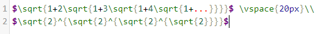
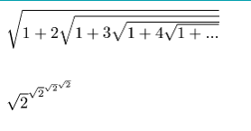
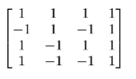
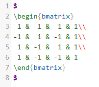
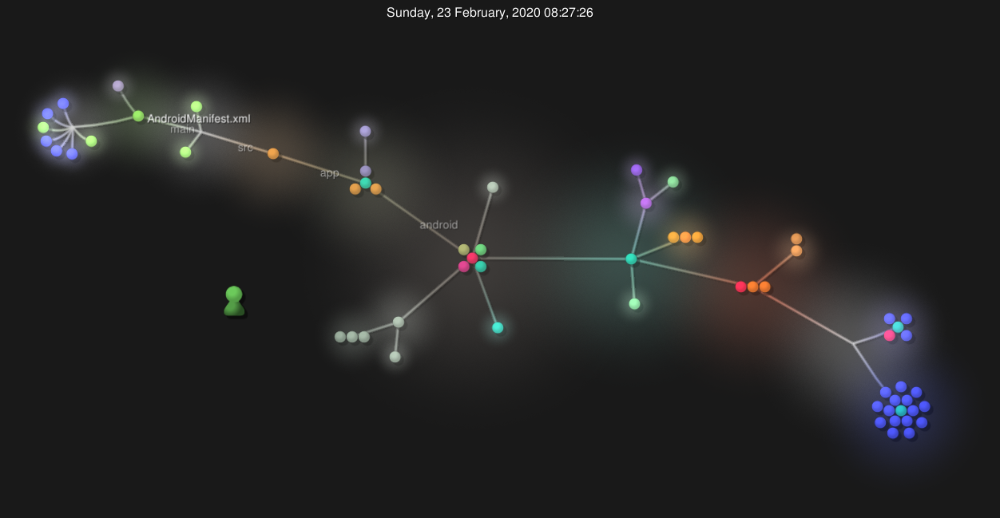
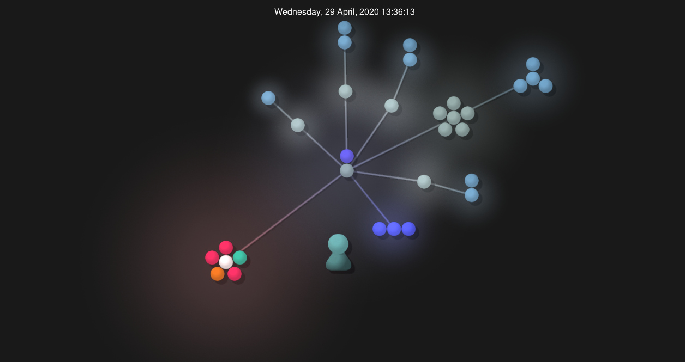
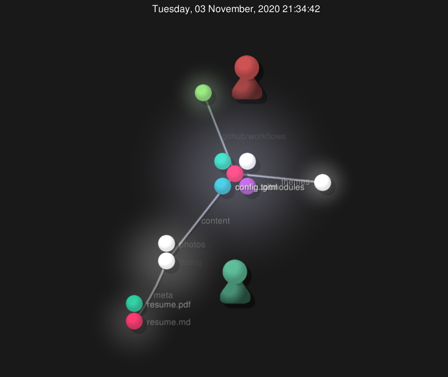

# Lab 3 Documentation and Community Development - June 7, 2019

## This Lab has two parts [Documentation](#part-1) and [Community](#part-2)

#### We talked about community and how people cooperate in order to contribute to a project. In this lab, we will explore this further using automatic tools, software and manually.

> This lab will be done in groups of 4-5. Each will be assigned a table number

> All the results should be documented in a `Lab3.md` and pushed to in your Github account.

### Part 1 - Documentation

- https://github.com/jakezam/oss-repo-template/wiki/Project-Ideas

1. Use latex [http://www.artofproblemsolving.com/texer](http://www.artofproblemsolving.com/texer) to generate the formulae depicted in [https://github.com/rcos/CSCI-4961-01-Summer-2018/blob/master/Labs/latex_formulae.png](https://github.com/rcos/CSCI-4961-01-Summer-2018/blob/master/Labs/latex_formulae.png)

1. Use latex to display a [Hadamard Matrix of size 4](http://mathworld.wolfram.com/HadamardMatrix.html) (equation 5). You can use just 1 and -1; although, if you want to make a matrix using the white and black boxes you are welcome to.

### Part 2 - Community

### Flutter ShuttleTracker

- Number of branches: 13
- Number of contributors: 5
- Lines of code: 37461
- First commit: Initial commit (3e7e97dfa70dc480a5a68b7ff70a8575bd93af50)
- Latest Commit: Commented Code and Documentation of the settings_page directory (63400bcc58b3dd0fdb4c626b56c04e3c242b8397) On branch (eta_panel)

### Insomnia Dialogue System

- the number of contributors: 3
- number of lines of code: 85996 total
- the first commit: commit 7d2dcb71edad3a3abdaf91b8ca8cd31a77752072 - "Initial Commit" on branch: master
- the latest commit: commit e5ada154e210d1962f7912b9989713620822de51 - "Final Push. Horizontal Scroll rects and generating buttons is good to go" on branch: master
- the current branches: just master

### MarketBot

- Number of branches: 8
- Number of contributors: 4
- Lines of code: 2313
- First commit: Initial commit (fa857b000c2c85ab167a19eb1b02ed26c16a891d)
- Latest Commit: Retrying drop gitignore files (77b7b88c2c12b1d153f1f19893827aafdac2811b) On branch master

### onmyownti.me

- contributors: 1
- lines of code: 2251
- first commit: "Initial commit" https://github.com/omot/onmyownti.me/commit/71a5be1c6422e8fe7a4467be5b58724a0cdcaae3
- latest commit: "updated theme to fix font" https://github.com/omot/onmyownti.me/commit/f8656e4ad6fbd35cb03b01897c5d03b9ad3d59d3
- current branches: "main", "preview"

1. Gitstats

   - Gitstats show tons of additional statistics for the repo of your choice, and it seems to be more accurate. It shows all authors and their commits, who is commiting most and when they are doing so, as well as every file, line, and bunch of code ordered by author contribution.

   1. Differences in Flutter Shuttle Tracker

      - Found 37,461 lines of code with git command vs 18,887 lines that gitstats said it found
      - Only counted 5 contributors when there is a total of 6 as gitstats found
      - Specified commits were constant between gitstats and github

   2. Differences in Insomnia Dialogue System

      - Found 85,996 lines of code with git command vs 30,634 lines that gitstats said it found
      - Only counted 3 contributors when there is a total of 4 as gitstats found
      - Specified commits were constant between gitstats and github

   3. Differences in MarketBot

      - Found 2,313 lines of code with git command vs 2,326 lines that gitstats said it found
      - Only counted 4 contributors when there is a total of 10 as gitstats found
      - Specified commits were constant between gitstats and github

   4. Differences in onmyownti.me

      - Found 2,251 lines of code with git command vs 1,949 lines that gitstats said it found
      - Only counted 1 contributors when there is a total of 4 as gitstats found
      - Specified commits were constant between gitstats and github

   > If you are curious, please read and try to understand the [python code for gitstats](https://github.com/hoxu/gitstats/blob/master/gitstats). (Its even better if you suggest some improvements!)

1. Streaming Contribution Visualizations

   - Git repository visualization for the Flutter Shuttle Tracker Project as of February 23, 2020
     
   - Git repository visualization for the Insomnia Dialogue System Project as of September 26, 2020
     
   - Git repository visualization for the MarketBot Project as of April 29, 2020
     
   - Git repository visualization for the onmyownti.me Project as of November 3, 2020
     

**Make sure to include screenshots and comments in your lab report.**
