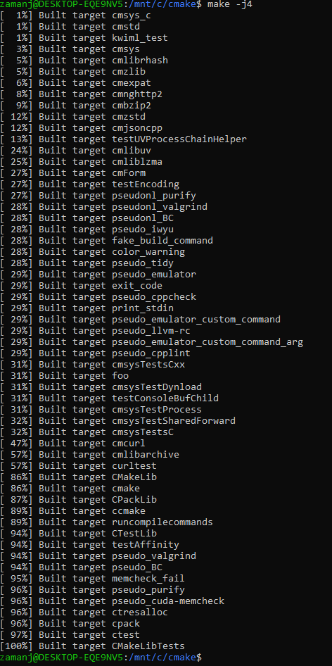
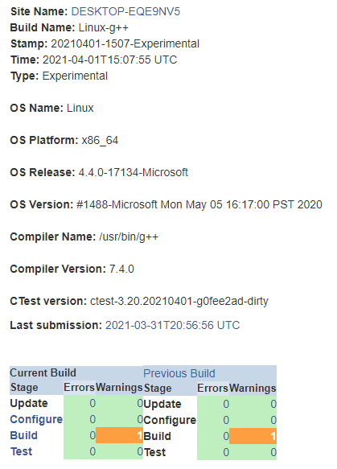
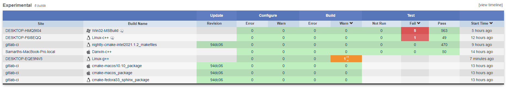
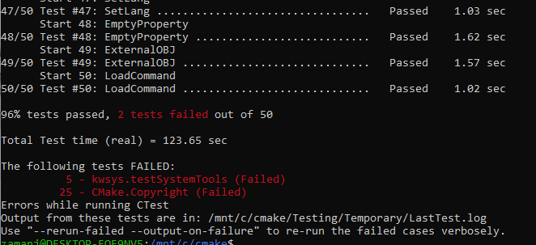
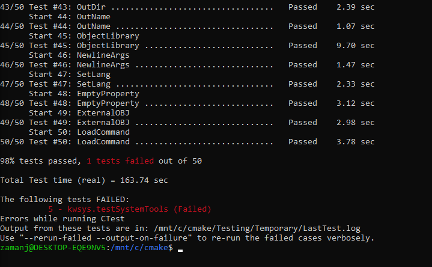
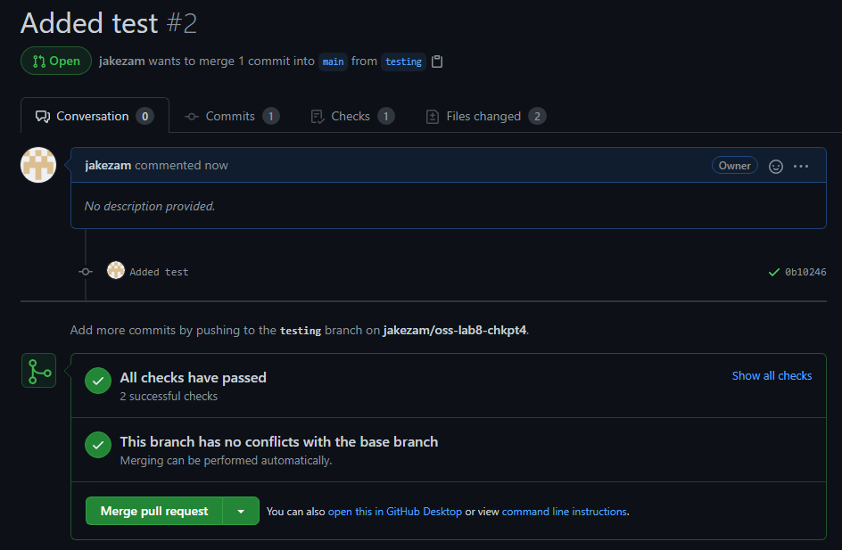

## Lab 8 - Testing and Continuous Integration 4/1/2021

1. Checkpoint 1

    - 

2. Checkpoint 2

    - 

    - 

3. Checkpoint 3

    - The test when putting in the copyright
    - 

    - The test when fixing the copyright (I still had one test fail and unfortunately could not figure out why it was not building)
    - 

3. Checkpoint 4

    - 

<!--
- Then create/fork a github repository for your project and work on your first commit
-->
