## Lab 9 - Virtualization 4/2/2021

1. Example 0

    - 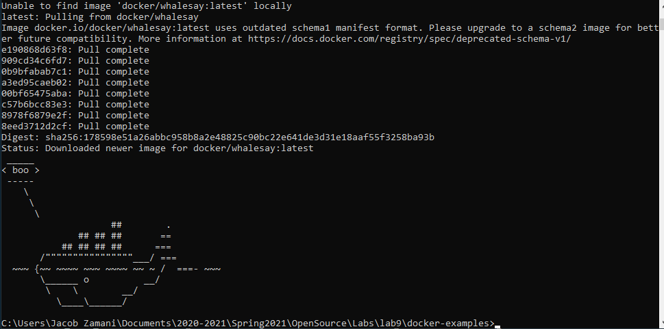

2. Example 1

    - 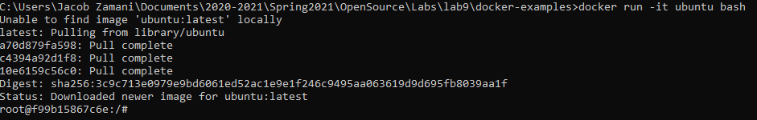

    - 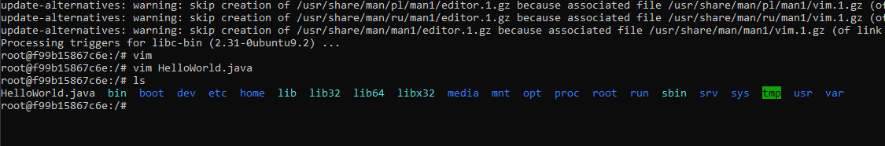

    - 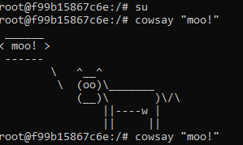

3. Example 2

    - 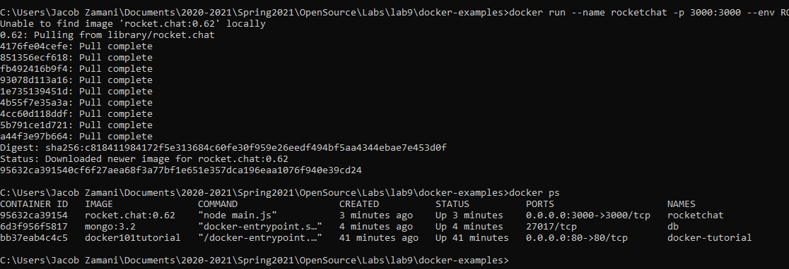

    - 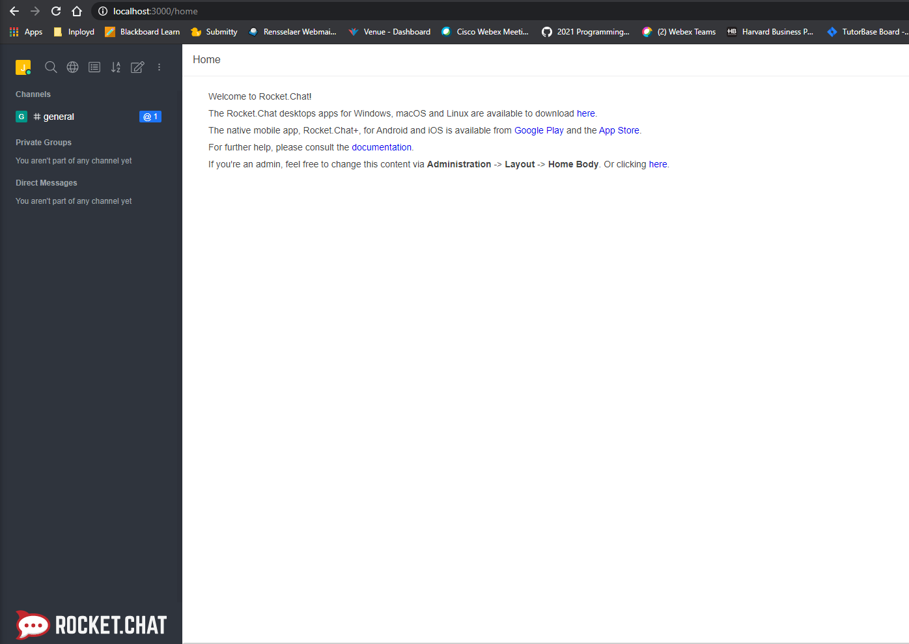

    - 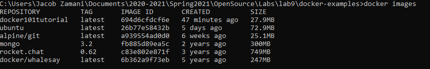

4. Example 3

    - 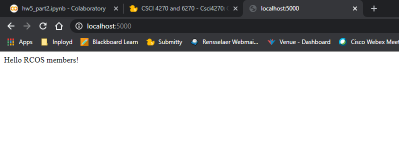

    - 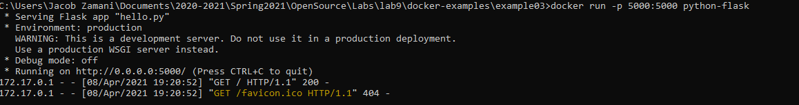

5. Example 4

    - 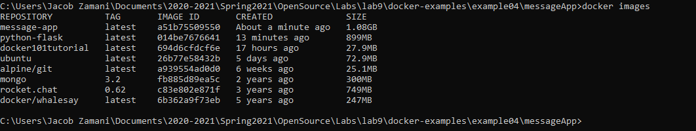

    - 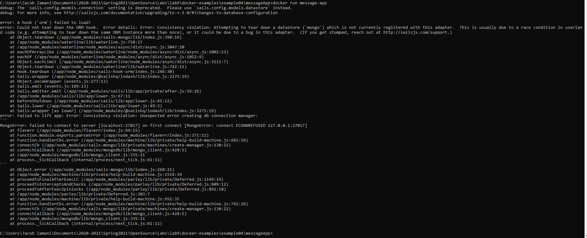

    - 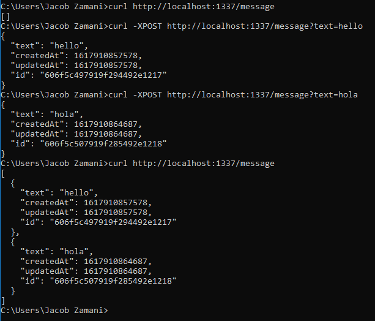

    - 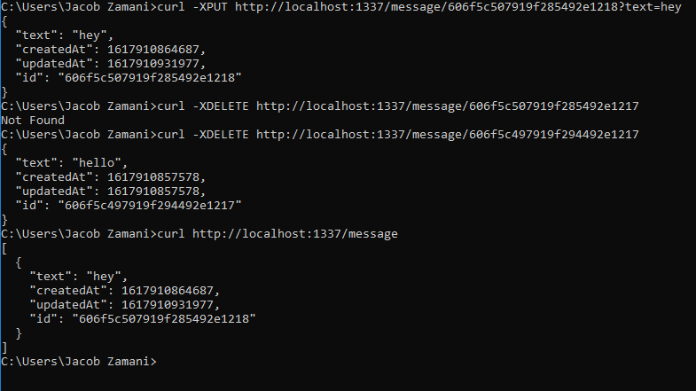

<!--
- Then create/fork a github repository for your project and work on your first commit
-->
