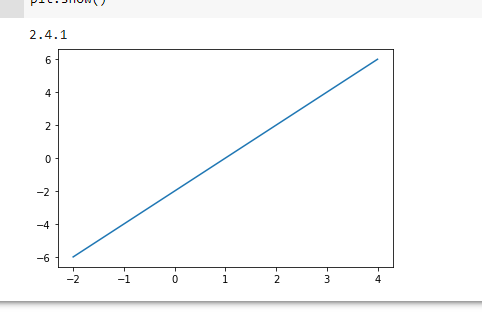
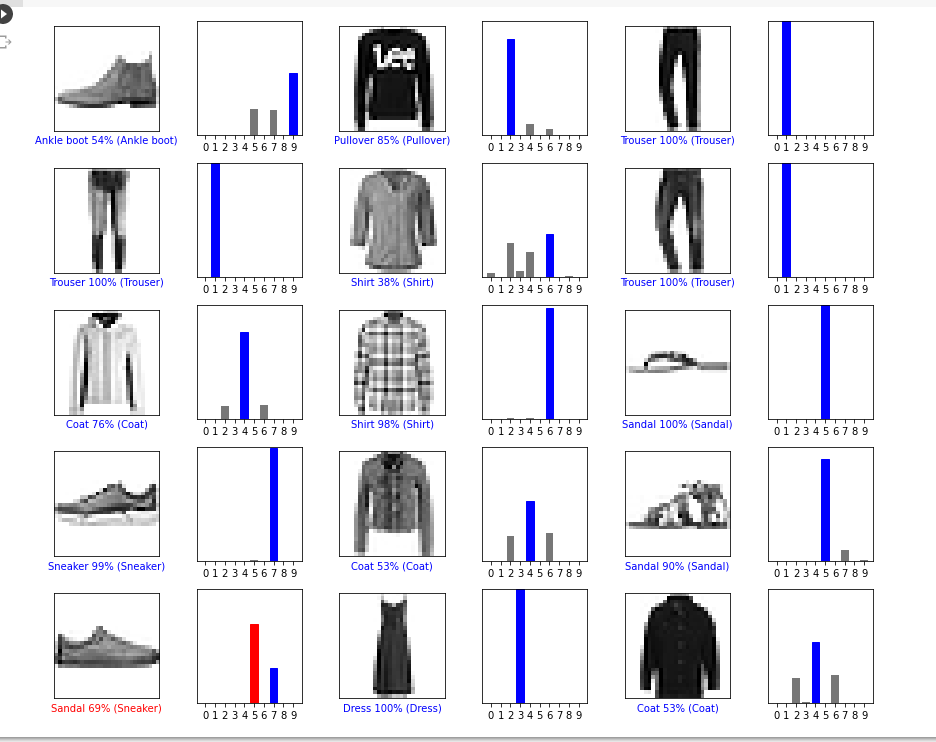
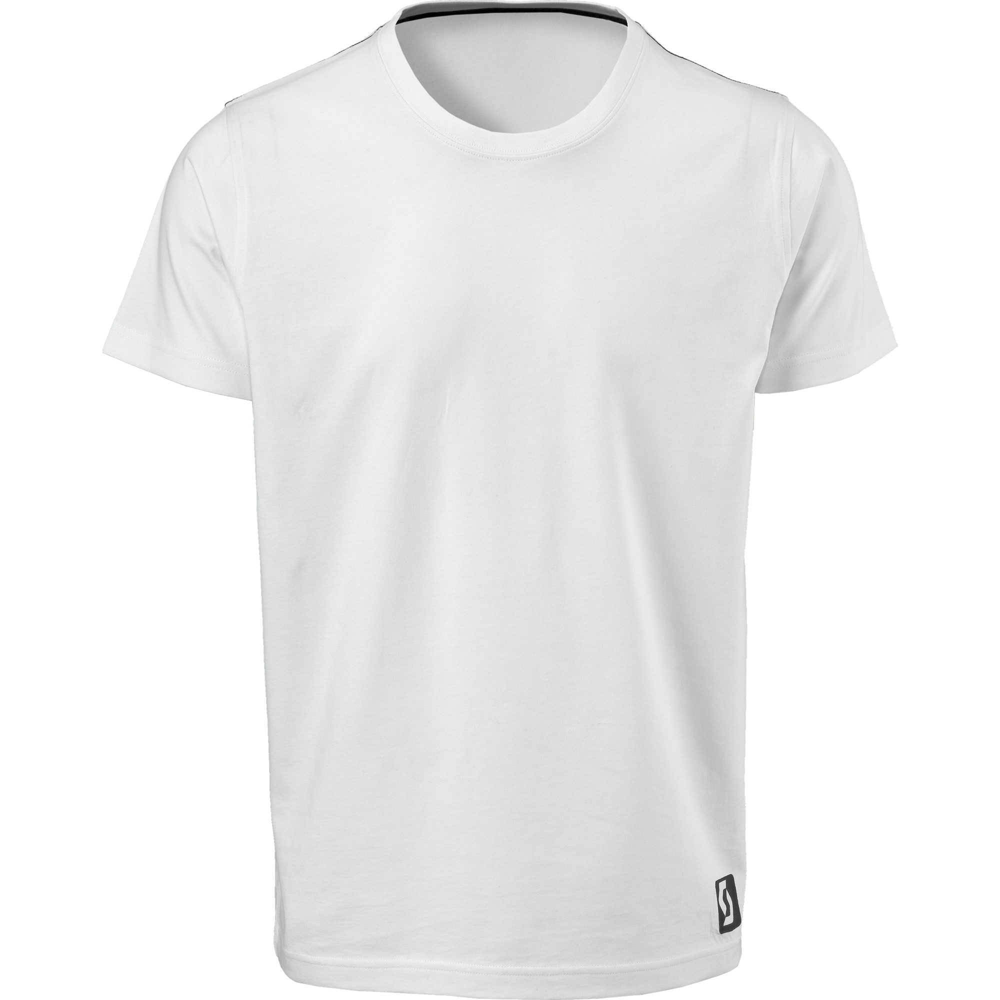
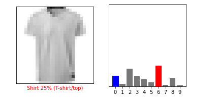
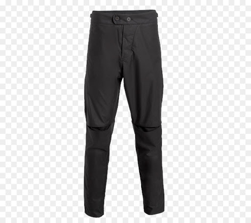
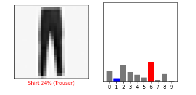
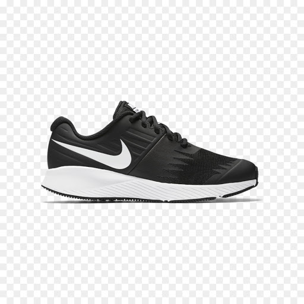
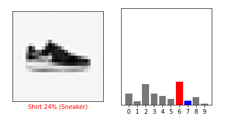

## Lab 11 - TensorFlow 4/16/2021

1. Checkpoint 1

    - 

2. Checkpoint 2

    - 

3. Checkpoint 3

    - 

    - 

    - 

    - 

    - 

    - 

    - 

    - 

    - 

<!--
- Then create/fork a github repository for your project and work on your first commit
-->
